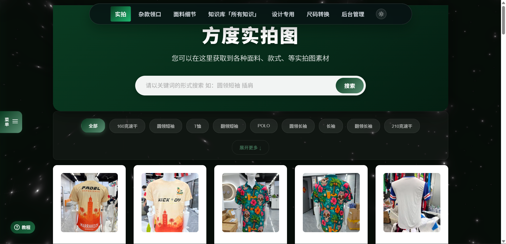
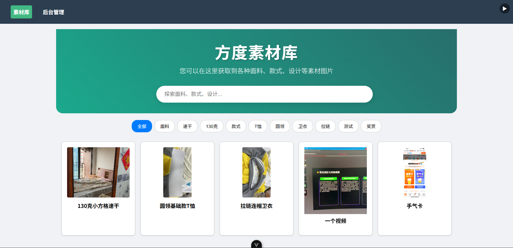

<div align="center">

# 方度素材库

为服饰行业打造的私有化多媒体素材管理平台

[](https://vuejs.org/)
[](https://nodejs.org/)
[](https://expressjs.com/)
[](https://www.sqlite.org/)

[快速开始](#快速开始) · [功能特性](#功能特性) · [技术栈](#技术栈) · [部署](#部署)



</div>

---

## 设计蜕变

从一个内部工具，经过三个阶段演进为具有专业视觉语言的产品。

<table>
<tr>
  <th align="center">v1 · 起点</th>
  <th align="center">v2 · 成长</th>
  <th align="center">v3 · 现在</th>
</tr>
<tr>
  <td align="center"></td>
  <td align="center"></td>
  <td align="center"></td>
</tr>
<tr>
  <td align="center">亮色基础版</td>
  <td align="center">蓝紫渐变探索期</td>
  <td align="center">深色星空主题</td>
</tr>
</table>

**v1 · 起点** — 完成核心功能验证：素材上传、搜索、标签管理。朴素的亮色布局，以可用为第一目标。

**v2 · 成长** — 陆续引入尺码工具、知识库入口、收藏夹、侧边菜单，功能快速扩张。视觉上探索了蓝紫渐变风格，但与品牌气质还不完全契合。

**v3 · 现在** — 确立了深色 `#060d08` + 鼠尾草绿 `#5a8f73` 的设计语言：WebGL 星空动态背景、磨砂玻璃卡片、浮动胶囊导航、暗/亮双主题切换。从一个工具升级为一个产品。

---

## 项目简介

方度素材库是一个为服饰行业设计的私有化部署多媒体资产管理平台，支持图片和视频的上传、分类、搜索、预览与快捷复制，同时内置打色卡、尺码转换等专业工具，以及完整的后台管理和访问统计系统。

---

## 功能特性

### 素材画廊

- 网格布局展示，无限滚动加载
- 多关键词搜索（空格分隔）+ 标签快速筛选
- 动态分类页面（可在后台配置）
- 图片点击灯箱预览，视频弹窗播放
- 快捷复制图片到剪贴板（自动降分辨率，提升复制速度）
- 一键复制图片 CDN 链接

### 专业工具

- **打色卡**：HEX / RGB / CMYK / Lab 色值互转，透明度调节，支持导出 PDF
- **尺码转换**：多规格换码标生成，一键复制对照表
- **面料细节**：外链跳转至方度面料知识库

### 后台管理

- 素材上传（拖拽 + 批量），支持阿里云 OSS 或本地存储
- 素材编辑、标签管理、删除
- 用户需求反馈管理（处理中 / 已完成状态流转）
- 顶部公告栏配置
- 动态导航分类配置（Slug + 标签关联）

### 访问统计

- 实时在线人数监控（30 秒心跳）
- 今日 / 7 日 / 30 日 PV、UV 趋势图（ECharts）
- IP 归属地分析（省份 / 城市分布）
- 访问时段热力分布
- 会话去重机制（同 IP 5 分钟内计 1 次）

### 用户体验

- WebGL 星空动态背景（ogl，鼠标交互）
- 暗色 / 亮色主题切换，持久化到 localStorage
- 磨砂玻璃卡片设计，深色底色
- 新手引导（driver.js 步骤式引导）
- 全局侧边抽屉（反馈提交 + 收藏夹）
- 响应式移动端导航（折叠菜单）
- 滚动隐藏导航栏，回到顶部按钮

---

## 技术栈

### 前端

| 库 | 用途 |
|---|---|
| Vue 3 + Vite | 核心框架 + 构建工具 |
| Vue Router 4 | 路由管理（含 JWT 守卫） |
| Pinia | 状态管理 |
| Element Plus | UI 组件库 |
| ECharts 6 | 数据可视化 |
| ogl | WebGL 星空背景 |
| Chroma.js | 色彩空间转换 |
| driver.js | 新手引导步骤 |
| html2canvas + jsPDF | 色卡导出 PDF |
| video.js | 视频播放器 |
| vue-easy-lightbox | 图片灯箱 |
| Axios | HTTP 请求（含 base URL 配置） |

### 后端

| 库 | 用途 |
|---|---|
| Express 4 | Web 框架 |
| Sequelize + SQLite3 | ORM + 数据库 |
| Multer | 文件上传 |
| ali-oss | 阿里云 OSS 对象存储 |
| jsonwebtoken | JWT 认证 |
| bcrypt | 密码加密 |

---

## 项目结构

```
fangdu/
├── frontend/
│   └── src/
│       ├── views/
│       │   ├── Gallery.vue          # 素材画廊（主页）
│       │   ├── ColorCard.vue        # 打色卡工具
│       │   ├── SizeConverter.vue    # 尺码转换
│       │   ├── Statistics.vue       # 访问统计
│       │   ├── Login.vue            # 管理员登录
│       │   ├── CategoryPage.vue     # 动态分类页
│       │   └── admin/               # 后台子页面
│       ├── components/
│       │   ├── GalaxyBackground.vue # WebGL 星空背景
│       │   ├── SideDrawer.vue       # 全局侧边抽屉
│       │   ├── TopAnnouncement.vue  # 顶部公告
│       │   ├── TutorialGuide.vue    # 新手引导
│       │   └── VideoModal.vue       # 视频播放弹窗
│       ├── composables/
│       │   ├── useApi.js            # 带 loading/error 的请求封装
│       │   └── useTheme.js          # 全局主题状态（单例）
│       ├── stores/                  # Pinia stores
│       ├── router/index.js          # 路由 + JWT 守卫 + 访问追踪
│       └── axiosConfig.js           # Axios 实例
│
└── backend/
    ├── server.js                    # Express 入口（class Server）
    ├── routes/                      # 路由注册
    ├── controllers/                 # 请求处理器
    ├── services/
    │   └── MaterialService.js       # OSS 上传 / CDN URL 生成
    ├── models/                      # Sequelize 模型
    ├── config/sequelize.js          # SQLite 连接配置
    ├── database/drawer_config.db    # SQLite 数据库文件
    └── uploads/                     # 本地文件存储（OSS 未配置时）
```

---

## 快速开始

### 环境要求

- Node.js ≥ 20.19.0
- npm ≥ 8.0.0

### 启动后端

```bash
cd backend
npm install
cp env.example .env       # 复制环境变量模板
# 编辑 .env，至少修改 JWT_SECRET 和 ADMIN_PASSWORD
npm run dev               # nodemon 监听模式，端口 3002
```

### 启动前端

```bash
cd frontend
npm install
npm run dev               # Vite 开发服务器，端口 5173
```

访问 `http://localhost:5173` 查看效果。管理后台入口：`/login`。

---

## 环境变量说明

复制 `backend/env.example` 到 `backend/.env` 后按需修改：

```env
# 服务配置
NODE_ENV=development
PORT=3002

# 安全配置（生产环境必须修改）
JWT_SECRET=your-secret-key-change-in-production
JWT_EXPIRES_IN=24h
SECRET_TOKEN=your-super-secret-token-here

# 管理员账号
ADMIN_USERNAME=admin
ADMIN_PASSWORD=your-admin-password-here

# 文件上传
MAX_FILE_SIZE=52428800    # 50MB，单位字节
UPLOAD_DIR=./uploads

# CORS（开发环境）
CORS_ORIGIN=http://localhost:5173

# 阿里云 OSS（可选，不填则使用本地 uploads/ 存储）
ALI_OSS_ACCESS_KEY_ID=
ALI_OSS_ACCESS_KEY_SECRET=
ALI_OSS_BUCKET=
ALI_OSS_REGION=oss-cn-guangzhou

# CDN 域名（OSS 启用时生效）
CDN_BASE_URL=https://your-cdn-domain.com
```

> 数据库使用 SQLite，无需额外安装和配置，文件自动创建于 `backend/database/drawer_config.db`。

---

## 部署

### 脚本部署（推荐）

```bash
# Linux / macOS
cp backend/env.example backend/.env
# 编辑 .env 填写生产配置
chmod +x deploy.sh
./deploy.sh

# Windows
copy backend\env.example backend\.env
.\deploy.ps1
```

脚本会自动安装依赖、构建前端、将 `frontend/dist` 静态文件由 Express 托管。

详见 [DEPLOY.md](./DEPLOY.md)。

### Docker 部署

```bash
# 构建镜像
docker build -t fangdu:latest .

# 运行容器
docker run -d \
  -p 3002:3002 \
  -v $(pwd)/backend/uploads:/app/backend/uploads \
  -v $(pwd)/backend/database:/app/backend/database \
  -v $(pwd)/backend/.env:/app/backend/.env \
  --name fangdu \
  fangdu:latest
```

或使用 Docker Compose：

```bash
docker-compose up -d
```

### 生产注意事项

- 修改 `JWT_SECRET`、`SECRET_TOKEN`、`ADMIN_PASSWORD` 为强随机值
- 建议使用 PM2 管理进程：`pm2 start server.js --name fangdu`
- 如使用 Nginx 反代，将 `/api` 和 `/uploads` 转发到 `localhost:3002`，其余路径指向 `frontend/dist`
- SQLite 数据库文件定期备份：`backend/database/drawer_config.db`

---

## 关键实现说明

**OSS / 本地存储切换**：`MaterialService` 检测 `ALI_OSS_*` 环境变量，有则上传 OSS，否则写本地 `uploads/`，对外 API 接口形态一致。

**CDN URL 转换**：OSS URL（`*.aliyuncs.com`）在后端通过 `CDN_BASE_URL` 替换为 CDN 域名；前端 Gallery.vue 中 `toCdnUrl()` 做同样处理。缩略图附加 OSS 处理参数 `?x-oss-process=image/resize,m_fill,w_300,quality,q_80`。

**快捷复制优化**：复制前对 CDN 图片追加 `resize,m_lfit,w_1500` 参数获取中等尺寸版本，Canvas toBlob 阶段同时限制最长边 1500px，避免大图复制卡顿。

**访问统计去重**：同一 IP 在 5 分钟内多次访问计为 1 次，由 `VisitService` 判断；SQLite 存储 UTC 时间，CST（UTC+8）范围查询通过 `datetime('now', '+8 hours', ...)` 处理。

**星空背景**：`GalaxyBackground.vue` 挂载在 `App.vue` 根层（在 KeepAlive 外），进入管理后台时通过 `v-show` + `paused` prop 停止 RAF 而非销毁 WebGL context，避免重建时的卡顿。

---

## License

[MIT](./LICENSE) © 2024 luoliguang
