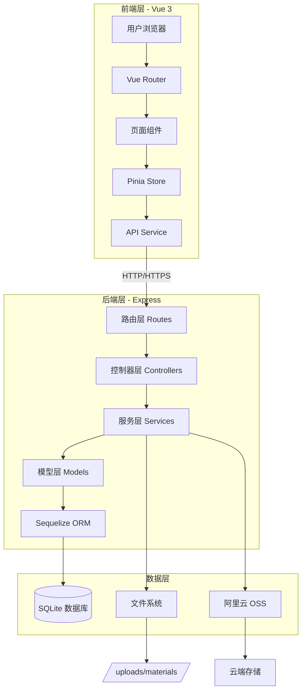
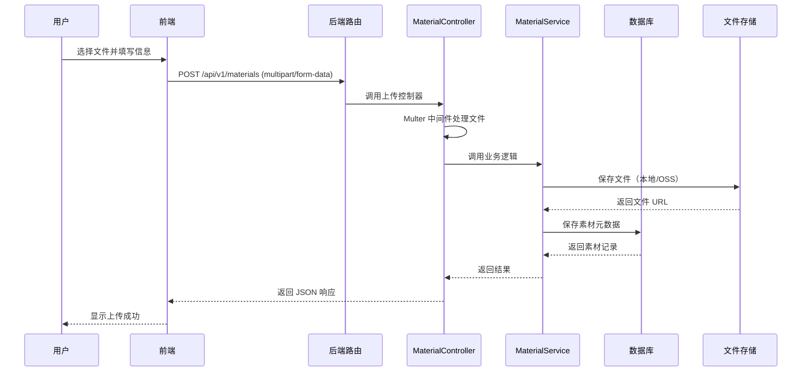
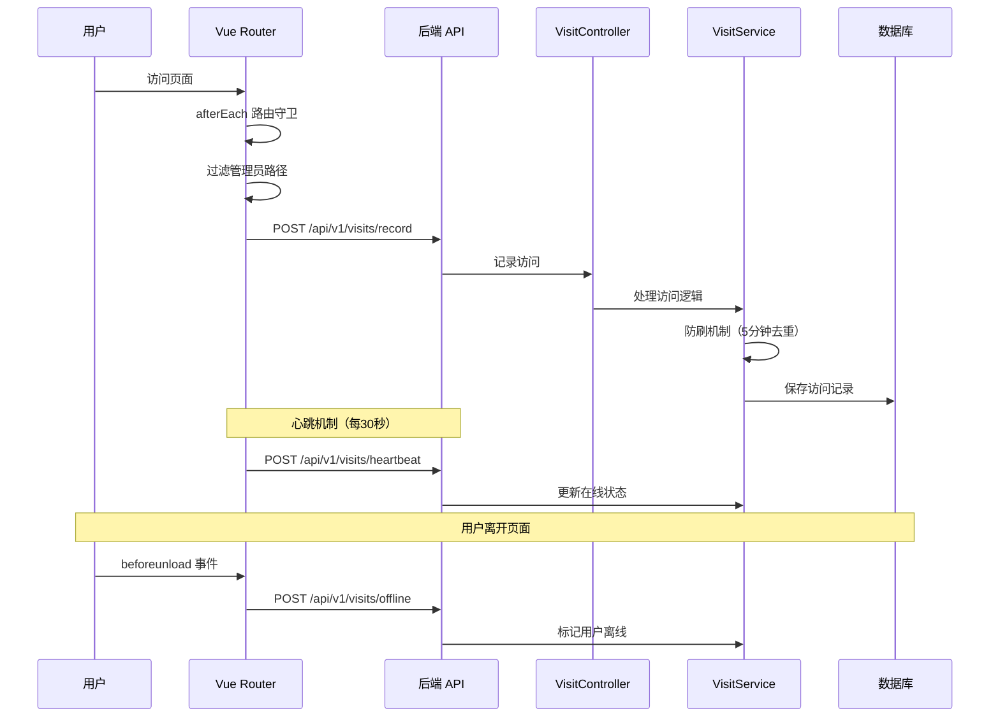
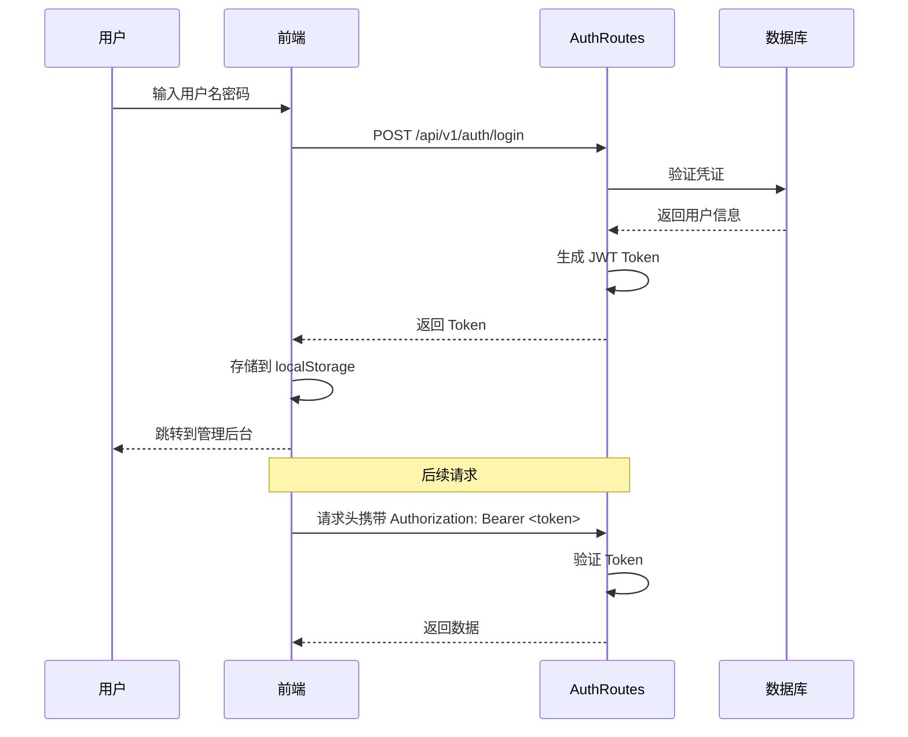
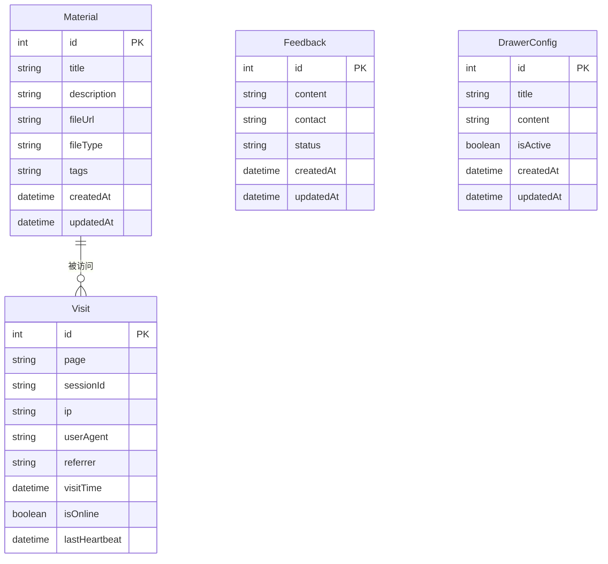

# 方度素材管理系统 - 项目总览

> **文档版本**: v1.0
> **更新日期**: 2026-03-28
> **目标读者**: 工程团队、新入职开发者

---

## 1. 项目简介

### 1.1 项目目标

方度素材管理系统是一个专为**服饰行业**设计的私有化部署多媒体资产管理平台，提供完整的素材生命周期管理能力。

**核心价值**:
- 统一管理服装企业的产品图片、设计稿、宣传视频
- 提供专业的色卡工具（HEX/RGB/CMYK/Lab 转换）和尺码转换器
- 实时访问统计与数据分析，支持业务决策
- 私有化部署，数据安全可控

### 1.2 当前状态

- **版本**: v1.5.0（生产稳定版）
- **部署方式**: 本地部署 / Docker / 云服务器
- **用户规模**: 单租户系统（待确认：是否支持多租户）
- **数据存储**: SQLite（本地）+ 阿里云 OSS（可选）

### 1.3 核心功能模块

| 模块 | 功能描述 | 状态 |
|------|---------|------|
| 素材管理 | 图片/视频上传、搜索、预览、标签管理 | ✅ 已完成 |
| 打色卡工具 | 多色彩空间转换、透明度调节、色值复制 | ✅ 已完成 |
| 尺码转换器 | 智能换码标生成、批量转换 | ✅ 已完成 |
| 访问统计 | 实时在线监控、访问趋势分析、防刷机制 | ✅ 已完成 |
| 用户反馈 | 全局侧边抽屉、反馈管理后台 | ✅ 已完成 |
| 管理后台 | 素材管理、数据统计、系统配置 | ✅ 已完成 |

---

## 2. 技术栈与关键依赖

### 2.1 前端技术栈

| 技术 | 版本 | 用途 | 备注 |
|------|------|------|------|
| **Vue.js** | 3.5.18 | 前端框架 | Composition API |
| **Vite** | 7.0.6 | 构建工具 | 开发服务器 + 生产构建 |
| **Vue Router** | 4.5.1 | 路由管理 | 支持路由守卫、访问统计 |
| **Pinia** | 3.0.3 | 状态管理 | 替代 Vuex |
| **Element Plus** | 2.11.4 | UI 组件库 | 管理后台主要使用 |
| **Axios** | 1.11.0 | HTTP 客户端 | API 请求封装 |
| **ECharts** | 6.0.0 | 数据可视化 | 访问统计图表 |
| **Chroma.js** | 3.1.2 | 色彩处理 | 打色卡工具核心库 |
| **vue-easy-lightbox** | 1.19.0 | 图片预览 | 灯箱效果 |
| **vue-toastification** | 2.0.0-rc.5 | 消息通知 | 全局 Toast |
| **md-editor-v3** | 6.0.1 | Markdown 编辑器 | 公告内容编辑 |
| **video.js** | 8.23.4 | 视频播放器 | 视频素材预览 |

### 2.2 后端技术栈

| 技术 | 版本 | 用途 | 备注 |
|------|------|------|------|
| **Node.js** | ≥20.19.0 | 运行环境 | 推荐 20.x LTS |
| **Express** | 4.20.0 | Web 框架 | RESTful API |
| **SQLite3** | 5.1.7 | 数据库 | 嵌入式数据库 |
| **Sequelize** | 6.37.7 | ORM 框架 | 数据模型管理 |
| **Multer** | 2.0.2 | 文件上传 | 多媒体文件处理 |
| **Ali OSS** | 6.23.0 | 云存储 | 可选，支持本地存储 |
| **cors** | 2.8.5 | 跨域处理 | CORS 中间件 |
| **dotenv** | 17.2.1 | 环境变量 | 配置管理 |

### 2.3 开发工具

| 工具 | 用途 | 配置文件 |
|------|------|---------|
| **npm** | 包管理器 | `package.json` |
| **ESLint** | 代码检查 | 待确认：配置文件位置 |
| **nodemon** | 后端热重载 | `backend/package.json` |
| **Git** | 版本控制 | `.gitignore` |
| **Docker** | 容器化部署 | `Dockerfile`, `docker-compose.yml` |

### 2.4 测试框架

**待确认**: 当前项目未发现测试文件，测试覆盖率未知。

---

## 3. 目录结构说明

### 3.1 整体结构

```
fangdu/
├── backend/              # 后端服务（Express + SQLite）
├── frontend/             # 前端应用（Vue 3 + Vite）
├── docs/                 # 项目文档
├── scripts/              # 自动化脚本
├── .claude/              # Claude AI 工作目录
├── .github/              # GitHub Actions 配置
├── .husky/               # Git Hooks
├── docker-compose.yml    # Docker 编排配置
├── Dockerfile            # Docker 镜像构建
├── deploy.sh             # Linux/macOS 部署脚本
├── deploy.ps1            # Windows 部署脚本
├── start.sh              # Linux/macOS 启动脚本
└── start.bat             # Windows 启动脚本
```

### 3.2 后端目录结构

```
backend/
├── server.js             # 服务器入口文件
├── package.json          # 依赖配置
├── .env                  # 环境变量（不提交到 Git）
├── env.example           # 环境变量模板
├── config/               # 配置文件
│   ├── server.js         # 服务器配置（端口、CORS、文件上传）
│   ├── database.js       # 数据库配置
│   └── sequelize.js      # Sequelize ORM 配置
├── controllers/          # 控制器层（处理 HTTP 请求）
│   ├── MaterialController.js      # 素材管理
│   ├── FeedbackController.js      # 用户反馈
│   ├── VisitController.js         # 访问统计
│   └── DrawerConfigController.js  # 侧边栏配置
├── services/             # 业务逻辑层
│   ├── MaterialService.js
│   ├── FeedbackService.js
│   └── VisitService.js
├── models/               # 数据模型（Sequelize）
│   ├── Material.js       # 素材模型
│   ├── Feedback.js       # 反馈模型
│   ├── Visit.js          # 访问记录模型
│   └── DrawerConfig.js   # 配置模型
├── routes/               # 路由定义
│   ├── index.js          # 路由汇总
│   ├── materialRoutes.js
│   ├── feedbackRoutes.js
│   ├── visitRoutes.js
│   ├── authRoutes.js
│   ├── drawerConfigRoutes.js
│   └── proxyRoutes.js    # 代理路由（待确认用途）
├── database/             # SQLite 数据库文件
│   └── *.db              # 数据库文件（不提交到 Git）
├── uploads/              # 本地文件存储
│   └── materials/        # 素材文件
└── utils/                # 工具函数
```

### 3.3 前端目录结构

```
frontend/
├── src/
│   ├── main.js           # 应用入口
│   ├── App.vue           # 根组件
│   ├── axiosConfig.js    # Axios 配置（待确认）
│   ├── router/           # 路由配置
│   │   └── index.js      # 路由定义 + 访问统计 + 心跳机制
│   ├── stores/           # Pinia 状态管理
│   │   ├── index.js      # Store 入口
│   │   ├── user.js       # 用户状态
│   │   ├── material.js   # 素材状态
│   │   └── feedback.js   # 反馈状态
│   ├── services/         # API 服务层
│   │   └── apiService.js # API 请求封装
│   ├── views/            # 页面组件
│   │   ├── Gallery.vue           # 素材画廊（首页）
│   │   ├── ColorCard.vue         # 打色卡工具
│   │   ├── SizeConverter.vue     # 尺码转换器
│   │   ├── Login.vue             # 登录页
│   │   ├── Admin.vue             # 管理后台布局
│   │   ├── UploadMaterial.vue    # 素材上传
│   │   ├── MaterialManagement.vue # 素材管理
│   │   ├── FeedbackManagement.vue # 反馈管理
│   │   ├── Statistics.vue        # 数据统计
│   │   └── admin/
│   │       └── DrawerConfig.vue  # 侧边栏配置
│   ├── components/       # 通用组件
│   │   ├── common/       # 基础组件（待确认）
│   │   ├── SideDrawer.vue        # 全局反馈抽屉
│   │   ├── VideoModal.vue        # 视频播放弹窗
│   │   └── TutorialGuide.vue     # 新手引导
│   ├── composables/      # 组合式函数（待确认）
│   └── utils/            # 工具函数（待确认）
├── public/               # 静态资源
├── dist/                 # 构建输出目录
├── vite.config.js        # Vite 配置
└── package.json          # 依赖配置
```

---

## 4. 系统架构与关键流程

### 4.1 整体架构



### 4.2 核心业务流程

#### 4.2.1 素材上传流程



#### 4.2.2 访问统计流程



#### 4.2.3 用户认证流程



### 4.3 数据模型关系



---

## 5. 核心模块说明

### 5.1 素材管理模块

**职责**: 处理多媒体素材的上传、存储、检索、预览和删除。

**关键文件**:
- 后端: `MaterialController.js`, `MaterialService.js`, `Material.js`
- 前端: `Gallery.vue`, `MaterialManagement.vue`, `UploadMaterial.vue`
- 路由: `materialRoutes.js`

**核心功能**:
- 文件上传（支持图片 JPG/PNG，视频 MP4/WebM）
- 多关键词搜索（空格分隔）
- 标签筛选
- 瀑布流/网格双布局
- 图片灯箱预览 + 视频弹窗播放

**依赖关系**:
- 依赖 Multer 处理文件上传
- 依赖阿里云 OSS SDK（可选）
- 依赖 Sequelize ORM 操作数据库

**输入输出**:
```javascript
// 上传素材 API
POST /api/v1/materials
Content-Type: multipart/form-data

Input: {
  file: File,
  title: string,
  description: string,
  tags: string  // 逗号分隔
}

Output: {
  success: boolean,
  data: {
    id: number,
    title: string,
    fileUrl: string,
    fileType: string,
    tags: string[],
    createdAt: datetime
  }
}
```

### 5.2 访问统计模块

**职责**: 记录用户访问行为，提供实时在线监控和数据分析。

**关键文件**:
- 后端: `VisitController.js`, `VisitService.js`, `Visit.js`
- 前端: `Statistics.vue`, `router/index.js` (访问记录逻辑)
- 路由: `visitRoutes.js`

**核心功能**:
- 页面访问记录（自动触发）
- 防刷机制（5分钟内同一 IP 只计 1 次）
- 心跳机制（每 30 秒更新在线状态）
- 实时在线人数统计
- 访问趋势分析（7天/30天）
- 热门页面排行

**关键实现**:
```javascript
// 前端路由守卫自动记录访问
router.afterEach(async (to, from) => {
  // 过滤管理员路径和登录页
  if (to.path.startsWith('/admin') || to.path === '/login') {
    return;
  }

  // 发送访问记录
  await apiClient.post('/api/v1/visits/record', {
    page: to.path,
    sessionId: getSessionId(),
    referrer: from.path
  });
});

// 心跳机制（每30秒）
setInterval(() => {
  apiClient.post('/api/v1/visits/heartbeat', { sessionId });
}, 30000);
```

**防刷机制**:
- 使用 IP + SessionId 组合去重
- 5 分钟内重复访问不计数
- 管理员路径不计入统计

### 5.3 打色卡工具模块

**职责**: 提供专业的色彩转换工具，支持多种色彩空间。

**关键文件**:
- 前端: `ColorCard.vue`
- 依赖: `chroma-js` (色彩处理库)

**核心功能**:
- 支持 HEX、RGB、CMYK、Lab 色彩空间
- 实时色彩预览
- 透明度调节
- 一键复制色值
- 色卡导出（待确认）

**技术实现**:
- 使用 Chroma.js 进行色彩空间转换
- 使用 html2canvas 生成色卡图片（待确认）

### 5.4 用户反馈模块

**职责**: 收集用户反馈，提供管理后台处理。

**关键文件**:
- 后端: `FeedbackController.js`, `FeedbackService.js`, `Feedback.js`
- 前端: `SideDrawer.vue`, `FeedbackManagement.vue`
- 路由: `feedbackRoutes.js`

**核心功能**:
- 全局侧边反馈抽屉
- 反馈提交（无需登录）
- 反馈状态管理（待处理/已处理/已关闭）
- 反馈列表查看（需管理员权限）

### 5.5 管理后台模块

**职责**: 提供管理员操作界面，包括素材管理、数据统计、系统配置。

**关键文件**:
- 前端: `Admin.vue`, `Login.vue`
- 后端: `authRoutes.js`
- 路由守卫: `router/index.js` (beforeEnter)

**核心功能**:
- JWT 认证登录
- 素材上传/编辑/删除
- 反馈管理
- 访问统计查看
- 侧边栏配置

**认证机制**:
```javascript
// 路由守卫
beforeEnter: (to, from, next) => {
  const token = localStorage.getItem('authToken');
  if (token) {
    next();
  } else {
    next('/login');
  }
}
```

---

## 6. 本地开发指南

### 6.1 环境准备

**必需软件**:
- Node.js ≥ 20.19.0 ([下载](https://nodejs.org/))
- npm ≥ 8.0.0 (随 Node.js 安装)
- Git ([下载](https://git-scm.com/))

**验证安装**:
```bash
node --version   # 应显示 v20.19.0 或更高
npm --version    # 应显示 8.0.0 或更高
git --version    # 应显示 git 版本
```

### 6.2 项目初始化

**1. 克隆项目**:
```bash
git clone https://github.com/luoliguang/fangdu.git
cd fangdu
```

**2. 安装后端依赖**:
```bash
cd backend
npm install
```

**3. 安装前端依赖**:
```bash
cd ../frontend
npm install
```

### 6.3 环境变量配置

**后端环境变量** (`backend/.env`):

```bash
# 复制模板文件
cd backend
cp env.example .env

# 编辑 .env 文件
# Windows: notepad .env
# Linux/macOS: nano .env
```

**关键配置项**:
```env
# 服务器配置
NODE_ENV=development
PORT=3002
HOST=localhost

# 数据库配置（SQLite 自动创建，无需额外配置）
DB_DATABASE=fangdu_dev

# 安全配置（必须修改）
JWT_SECRET=your-secret-key-change-in-production
SECRET_TOKEN=your-admin-token
ADMIN_USERNAME=admin
ADMIN_PASSWORD=admin123

# CORS 配置
CORS_ORIGIN=http://localhost:5174

# 阿里云 OSS（可选，留空则使用本地存储）
ALI_OSS_ACCESS_KEY_ID=
ALI_OSS_ACCESS_KEY_SECRET=
ALI_OSS_BUCKET=
ALI_OSS_REGION=oss-cn-guangzhou
```

**前端环境变量**:

前端配置在 `frontend/src/config/env.js` 中（待确认），默认连接 `http://localhost:3002`。

### 6.4 启动开发服务器

**方式一：分别启动（推荐）**

```bash
# 终端 1: 启动后端（端口 3002）
cd backend
npm run dev

# 终端 2: 启动前端（端口 5174）
cd frontend
npm run dev
```

**方式二：使用启动脚本**

```bash
# Linux/macOS
./start.sh

# Windows
start.bat
```

**访问地址**:
- 前端: http://localhost:5174
- 后端 API: http://localhost:3002/api/v1/*
- 管理后台: http://localhost:5174/admin

### 6.5 开发工作流

**1. 前端开发**:
```bash
cd frontend
npm run dev          # 启动开发服务器（支持热重载）
npm run build        # 构建生产版本
npm run preview      # 预览生产构建
```

**2. 后端开发**:
```bash
cd backend
npm run dev          # 使用 nodemon 启动（自动重启）
npm start            # 生产模式启动
npm run lint         # 代码检查
npm run lint:fix     # 自动修复代码问题
```

**3. 代码修改**:
- 前端修改会自动热重载（Vite HMR）
- 后端修改会自动重启服务（nodemon）
- 修改 `.env` 文件需手动重启后端

### 6.6 常见问题

#### 问题 1: 端口被占用

**错误**: `Error: listen EADDRINUSE: address already in use :::3002`

**解决**:
```bash
# Windows
netstat -ano | findstr :3002
taskkill /PID <PID> /F

# Linux/macOS
lsof -i :3002
kill -9 <PID>
```

#### 问题 2: 数据库连接失败

**错误**: `SQLITE_CANTOPEN: unable to open database file`

**解决**:
```bash
mkdir -p backend/database
chmod 755 backend/database
rm backend/database/*.db  # 重新初始化
npm run dev
```

#### 问题 3: CORS 错误

**错误**: `No 'Access-Control-Allow-Origin' header`

**解决**: 检查 `backend/.env` 中 `CORS_ORIGIN=http://localhost:5174`

#### 问题 4: 文件上传失败

**解决**:
```bash
mkdir -p backend/uploads/materials
chmod 755 backend/uploads
```

---

## 7. 测试与质量保障

### 7.1 测试现状

**待确认**: 当前项目未发现测试文件和测试配置。

**建议补充**:
- 单元测试框架（Jest / Vitest）
- 集成测试（Supertest）
- E2E 测试（Playwright / Cypress）

### 7.2 代码质量工具

**ESLint**:
```bash
cd backend
npm run lint         # 检查代码规范
npm run lint:fix     # 自动修复
```

**待确认**: 前端 ESLint 配置位置。

### 7.3 CI/CD

**GitHub Actions**: 项目包含 `.github/` 目录，但具体配置待确认。

**建议流程**:
1. 代码提交触发 CI
2. 运行 lint 检查
3. 运行测试套件
4. 构建生产版本
5. 部署到测试/生产环境

---

## 8. 发布与部署流程

### 8.1 部署环境

| 环境 | 用途 | 访问方式 |
|------|------|---------|
| 开发环境 | 本地开发调试 | localhost:5174 |
| 测试环境 | 功能测试验证 | 待确认 |
| 生产环境 | 正式对外服务 | 待确认 |

### 8.2 Docker 部署（推荐）

**使用 Docker Compose**:
```bash
# 1. 配置环境变量
cp backend/env.example backend/.env
# 编辑 .env 文件

# 2. 启动服务
docker-compose up -d

# 3. 查看状态
docker-compose ps

# 4. 查看日志
docker-compose logs -f

# 5. 停止服务
docker-compose down
```

**手动 Docker 部署**:
```bash
# 构建镜像
docker build -t fangdu:latest .

# 运行容器
docker run -d \
  -p 3002:3002 \
  -v $(pwd)/backend/uploads:/app/backend/uploads \
  -v $(pwd)/backend/database:/app/backend/database \
  -v $(pwd)/backend/.env:/app/backend/.env \
  --name fangdu-app \
  fangdu:latest
```

### 8.3 传统部署流程

**1. 服务器准备**:
```bash
# 安装 Node.js 20.x
curl -fsSL https://deb.nodesource.com/setup_20.x | sudo -E bash -
sudo apt install -y nodejs

# 安装 PM2
sudo npm install -g pm2
```

**2. 部署代码**:
```bash
# 克隆代码
git clone https://github.com/luoliguang/fangdu.git
cd fangdu

# 安装依赖
cd backend && npm install --production
cd ../frontend && npm install && npm run build
```

**3. 配置环境变量**:
```bash
cd backend
cp env.example .env
nano .env  # 修改为生产配置

# 关键配置
NODE_ENV=production
JWT_SECRET=<生成强密钥>
ADMIN_PASSWORD=<设置强密码>
```

**4. 启动服务**:
```bash
# 使用 PM2 启动
cd backend
pm2 start server.js --name fangdu-backend --env production

# 设置开机自启
pm2 startup
pm2 save
```

**5. 配置 Nginx（可选）**:
```nginx
server {
    listen 80;
    server_name your-domain.com;

    location / {
        root /path/to/fangdu/frontend/dist;
        try_files $uri $uri/ /index.html;
    }

    location /api {
        proxy_pass http://localhost:3002;
        proxy_set_header Host $host;
        proxy_set_header X-Real-IP $remote_addr;
    }
}
```

### 8.4 部署检查清单

- [ ] 修改所有默认密码和密钥
- [ ] 配置 CORS 为生产域名
- [ ] 启用 HTTPS（使用 Certbot）
- [ ] 配置防火墙规则
- [ ] 设置数据库备份计划
- [ ] 配置日志轮转
- [ ] 测试文件上传功能
- [ ] 验证访问统计正常工作

### 8.5 回滚流程

**使用 PM2**:
```bash
# 查看进程列表
pm2 list

# 重启服务
pm2 restart fangdu-backend

# 查看日志
pm2 logs fangdu-backend --lines 100
```

**使用 Git**:
```bash
# 回滚到上一个版本
git log --oneline  # 查看提交历史
git checkout <commit-hash>
npm install
pm2 restart fangdu-backend
```

**使用 Docker**:
```bash
# 回滚到之前的镜像
docker images  # 查看镜像列表
docker stop fangdu-app
docker rm fangdu-app
docker run -d --name fangdu-app fangdu:<previous-tag>
```

---

## 9. 风险与技术债

### 9.1 高优先级风险

| 风险项 | 影响 | 建议措施 |
|--------|------|---------|
| **缺少测试覆盖** | 代码质量无保障，重构困难 | 补充单元测试和集成测试 |
| **SQLite 性能瓶颈** | 高并发场景下性能不足 | 考虑迁移到 PostgreSQL/MySQL |
| **无 API 限流** | 易受 DDoS 攻击 | 添加 rate-limiting 中间件 |
| **JWT 无刷新机制** | Token 过期后需重新登录 | 实现 refresh token 机制 |
| **文件存储无清理** | 磁盘空间持续增长 | 实现定期清理未使用文件 |

### 9.2 中优先级技术债

| 技术债 | 影响 | 建议措施 |
|--------|------|---------|
| **前端环境变量管理** | 配置不统一 | 使用 `.env` 文件统一管理 |
| **错误处理不统一** | 调试困难 | 统一错误处理中间件 |
| **日志系统缺失** | 问题排查困难 | 集成 Winston/Pino 日志库 |
| **API 文档不完整** | 前后端协作效率低 | 使用 Swagger/OpenAPI |
| **代码注释不足** | 新人上手困难 | 补充关键逻辑注释 |

### 9.3 低优先级改进

- 前端组件库使用不统一（Element Plus + 自定义组件）
- 缺少 TypeScript 类型检查
- 缺少性能监控和错误追踪（如 Sentry）
- 缺少数据库迁移工具（Sequelize Migrations）
- 缺少 API 版本管理策略

---

## 10. 建议的下一步路线图

### 10.1 短期目标（1-3 个月）

**优先级 P0（必须完成）**:
- [ ] 补充单元测试和集成测试（目标覆盖率 60%+）
- [ ] 添加 API 限流和防刷机制
- [ ] 实现完整的错误处理和日志系统
- [ ] 补充 API 文档（Swagger）
- [ ] 修复已知安全漏洞

**优先级 P1（重要）**:
- [ ] 优化访问统计性能（考虑使用 Redis 缓存）
- [ ] 实现文件存储清理机制
- [ ] 添加数据库备份和恢复脚本
- [ ] 完善前端错误边界处理
- [ ] 添加性能监控（响应时间、内存使用）

### 10.2 中期目标（3-6 个月）

**功能增强**:
- [ ] 多用户系统（用户注册、角色权限）
- [ ] 批量操作（批量上传、编辑、删除）
- [ ] 高级搜索（AI 语义搜索、智能推荐）
- [ ] 素材审核工作流
- [ ] 数据导出功能（Excel、CSV）

**技术升级**:
- [ ] 迁移到 PostgreSQL/MySQL（支持更高并发）
- [ ] 引入 TypeScript（提升代码质量）
- [ ] 实现 CI/CD 自动化部署
- [ ] 添加 E2E 测试
- [ ] 优化前端性能（代码分割、懒加载）

### 10.3 长期目标（6-12 个月）

**架构演进**:
- [ ] 微服务架构拆分（素材服务、用户服务、统计服务）
- [ ] 引入消息队列（RabbitMQ/Kafka）处理异步任务
- [ ] 实现分布式文件存储
- [ ] 添加全文搜索引擎（Elasticsearch）
- [ ] 实现多租户支持

**新功能**:
- [ ] AI 智能标签自动生成
- [ ] 在线图片编辑器
- [ ] 移动端 App（React Native）
- [ ] 第三方集成（Slack、企业微信）
- [ ] 国际化支持（i18n）

---

## 11. 附录

### 11.1 关键 API 端点

| 端点 | 方法 | 权限 | 描述 |
|------|------|------|------|
| `/api/v1/materials` | GET | 公开 | 获取素材列表 |
| `/api/v1/materials` | POST | 管理员 | 上传素材 |
| `/api/v1/materials/:id` | PUT | 管理员 | 更新素材 |
| `/api/v1/materials/:id` | DELETE | 管理员 | 删除素材 |
| `/api/v1/feedbacks` | POST | 公开 | 提交反馈 |
| `/api/v1/feedbacks` | GET | 管理员 | 获取反馈列表 |
| `/api/v1/visits/record` | POST | 公开 | 记录访问 |
| `/api/v1/visits/heartbeat` | POST | 公开 | 发送心跳 |
| `/api/v1/visits/overview` | GET | 管理员 | 获取统计概览 |
| `/api/v1/auth/login` | POST | 公开 | 管理员登录 |

### 11.2 数据库表结构

**Materials 表**:
- `id`: 主键
- `title`: 标题
- `description`: 描述
- `fileUrl`: 文件 URL
- `fileType`: 文件类型（image/video）
- `tags`: 标签（JSON 数组）
- `createdAt`, `updatedAt`: 时间戳

**Visits 表**:
- `id`: 主键
- `page`: 访问页面
- `sessionId`: 会话 ID
- `ip`: IP 地址
- `userAgent`: 用户代理
- `referrer`: 来源页面
- `visitTime`: 访问时间
- `isOnline`: 是否在线
- `lastHeartbeat`: 最后心跳时间

**Feedbacks 表**:
- `id`: 主键
- `content`: 反馈内容
- `contact`: 联系方式
- `status`: 状态（pending/processed/closed）
- `createdAt`, `updatedAt`: 时间戳

### 11.3 相关文档

- [README.md](../README.md) - 项目介绍和快速开始
- [DEPLOY.md](../DEPLOY.md) - 详细部署指南
- [QUICK_START.md](../QUICK_START.md) - 快速参考
- [API.md](./API.md) - API 接口文档（待确认）
- [SECURITY.md](./SECURITY.md) - 安全配置指南（待确认）

### 11.4 联系方式

- **GitHub**: https://github.com/luoliguang/fangdu
- **Issues**: https://github.com/luoliguang/fangdu/issues
- **Discussions**: https://github.com/luoliguang/fangdu/discussions

---

**文档维护**: 本文档应随项目演进持续更新，建议每个 Sprint 结束后审查一次。

**最后更新**: 2026-03-28 by Claude AI


